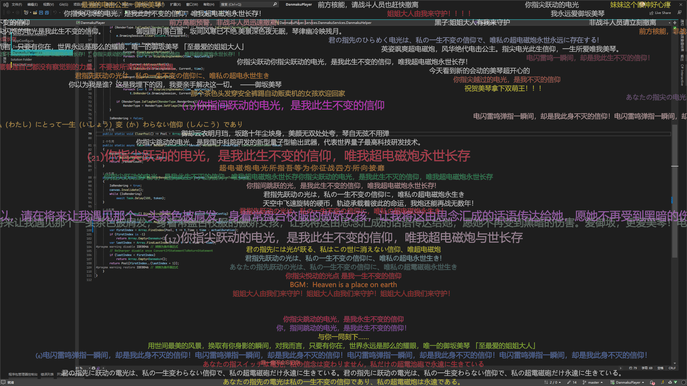
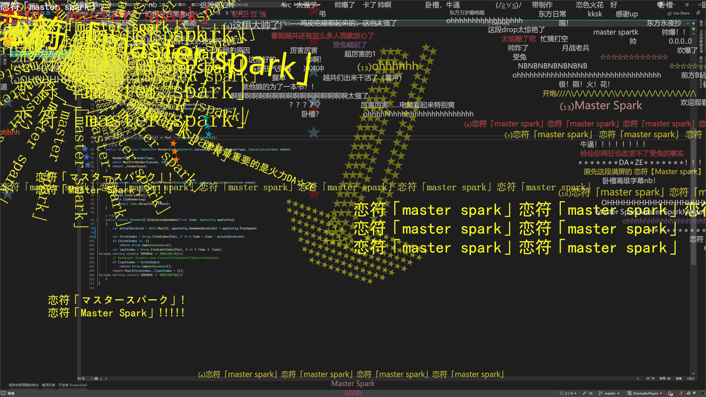

# DanmakuPlayer

* 支持 [bilibili](bilibili.com) xml格式和protobuf直接下载的弹幕文件的透明弹幕播放器

* UI使用WinUI3框架，上个WPF版本 [链接](https://github.com/Poker-sang/DanmakuPlayerWpf)

* 获取弹幕依赖 [protobuf-net](https://github.com/protobuf-net/protobuf-net) 库

* 弹幕渲染使用 [Win2D](https://github.com/Microsoft/Win2D) 库

* WebView2操作使用 [Playwright](https://github.com/microsoft/playwright-dotnet) 自动化

* 龟速更新中

## 预览

B站视频[【炮姐/AMV】我永远都会守护在你的身边！](https://www.bilibili.com/video/BV1Js411o76u)和
[【半年制作量】东方mmd：永远亭争夺战（pv风 踩点 特效向）](https://www.bilibili.com/video/BV1QA411t76e)

### 完整弹幕

### 合并类似弹幕、同屏不重叠

### M7高级弹幕

### 与背后播放器同步

## 使用说明

⚠️：指实现比较困难的功能

### 界面

* [x] 透明窗口

* [x] 固定最上层

* [x] 改变主题色

### 弹幕文件

* [x] 从本地打开（.xml 类型）

* [x] 用bilibili API通过av、BV、cid、md、ss、ep等下载

* [x] 分P获取弹幕

* [x] 获取全弹幕

### 播放

* [x] 调整快进速度

* [x] 调整播放倍速

* [x] 长按右键时播放3倍速

* [x] 暂停、快进等快捷键

* [x] 播放时允许调整窗口大小

* [x] 播放时调整设置

* [x] 输入进度条

* [x] 和背后网页播放器同步

* [x] 支持同时调整软件和网页视频的倍速、进度条、音量、播放暂停等

* [x] 支持网页视频包含在`<iframe/>`标签内

* [x] 有网页时，支持拖动进度条

### 弹幕

* [x] 顶端、底端、滚动、逆向、彩色弹幕

* [x] 调整透明度

* [x] 调整滚动速度

* [x] 出现位置算法优化

* [x] 弹幕不重叠

* [x] 大小弹幕

* [x] 弹幕字体

* [x] 合并类似弹幕

* [x] 大小弹幕出现位置优化

* [x] 再次优化弹幕出现算法

* [x] 正则屏蔽弹幕

* [x] 同屏最多（滚动、底端、顶端、逆向）弹幕限制

* [x] 弹幕阴影、描边等效果

* [x] M7高级弹幕基础功能

* [ ] ⚠️ M7高级弹幕Y轴翻转、跟踪拾取

* [ ] ⚠️ M9代码弹幕

### 其他

* [x] 弹幕多时流畅度

* [x] 优化项目结构

* [x] 逐步加载弹幕以降低占用

* [ ] ⚠️ 正则高亮与错误提示

* [ ] 其他常用功能...（没考虑到的x）

## 关于项目

项目名称：DanmakuPlayer

项目地址：[GitHub](https://github.com/Poker-sang/DanmakuPlayer)

版本：3.6.1

## 联系方式

作者：[扑克](https://github.com/Poker-sang)

邮箱：[poker_sang@outlook.com](mailto:poker_sang@outlook.com)

QQ：[2639914082](http://wpa.qq.com/msgrd?v=3&uin=2639914082&site=qq&menu=yes)

2024.2.2
